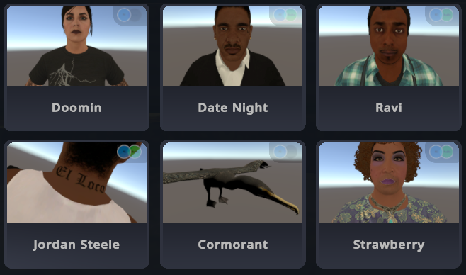
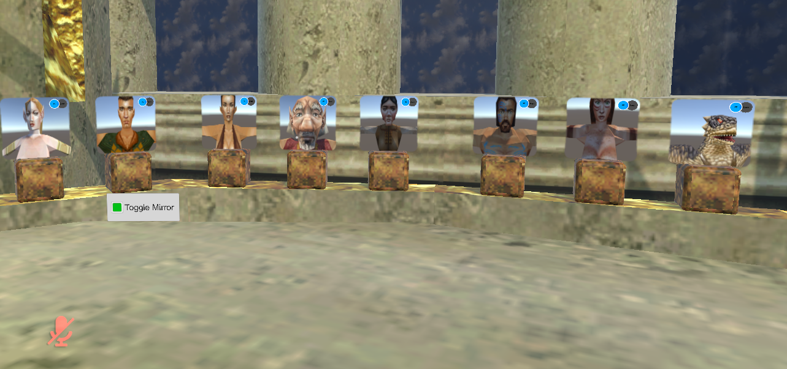
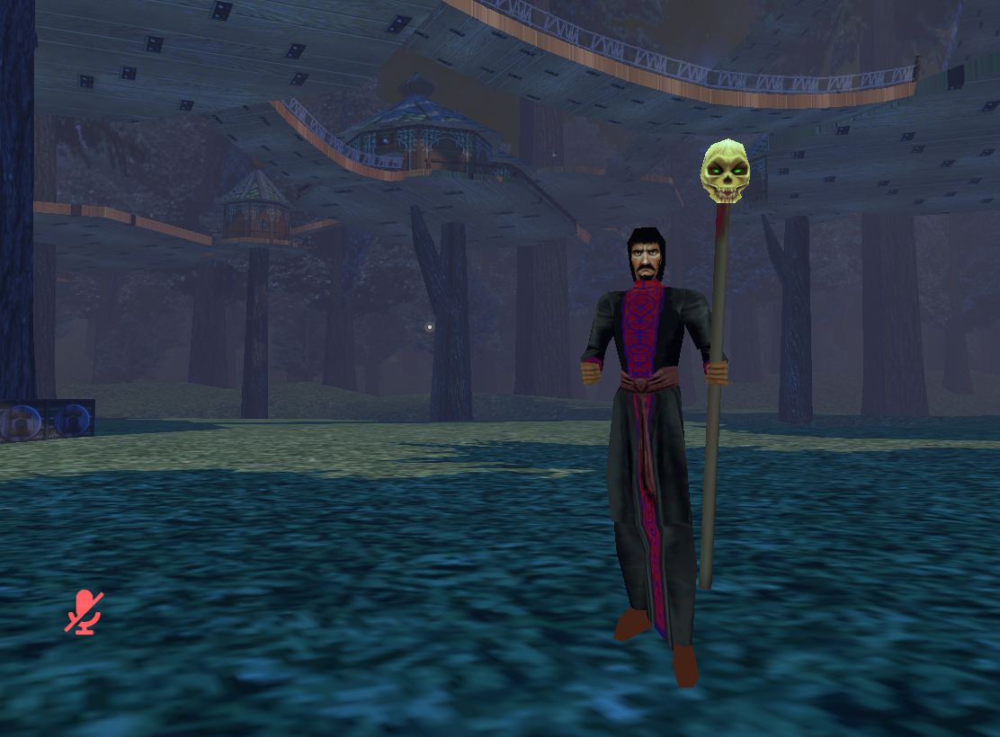

### Hi, welcome to my projects

## VRChat
I've created a number of VRChat avatars by extracting meshes from GTA 5 and Everquest game files.
- Here's an [introductory tutorial](https://www.youtube.com/watch?v=U-TJACOPOtw) on ripping and rigging GTA5 meshes.

Recently I've began publishing zones from Everquest into VRChat using [LanternEQ Tools](https://www.lanterneq.com).

### Documentation
[Work in Progress](https://github.com/mundiplaga/vrchat/wiki)

- [Everquest Avatar World](https://github.com/mundiplaga/vrchat/wiki/Avatar-World) 

- [Kelethin/Greater Faydark](https://github.com/mundiplaga/vrchat/wiki/Kelethin) 

## Discord Projects

- [StableDiffusion Discord Chat Integration](https://github.com/mundiplaga/jester-bot)

## Music
I've played drums in a few bands over the years.

- [KaPlaa](https://kaplaa.bandcamp.com/)
- [Samsquanch](https://samsquanchyeah.bandcamp.com/album/ocelot-of-problems)
- [My Own Mindset](https://myownmindset.bandcamp.com/track/all-your-stories)

## You can reach me on [Discord](https://discordapp.com/users/mundiplaga)
